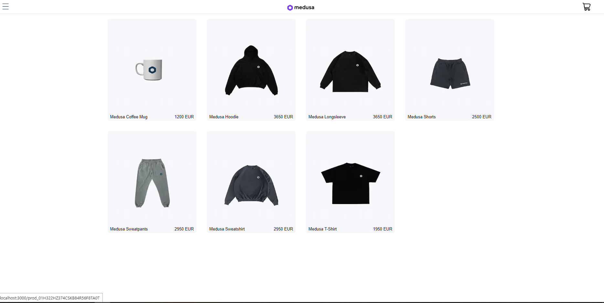
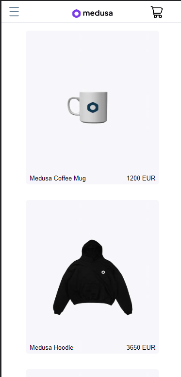
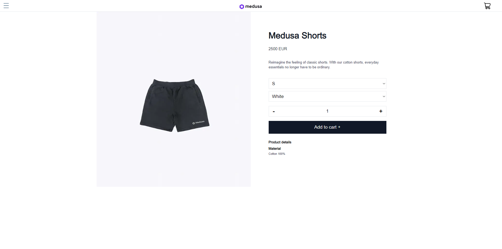
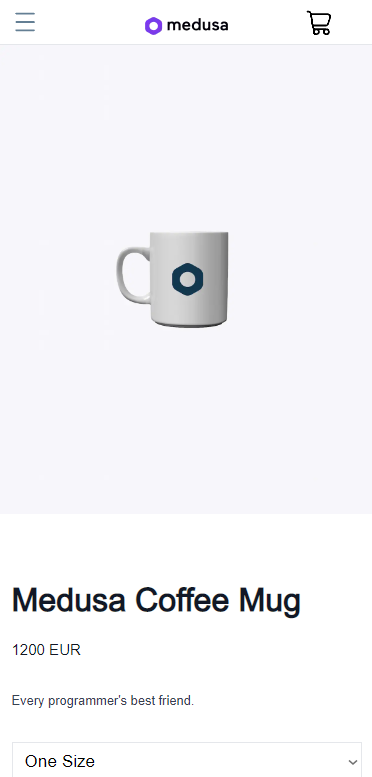
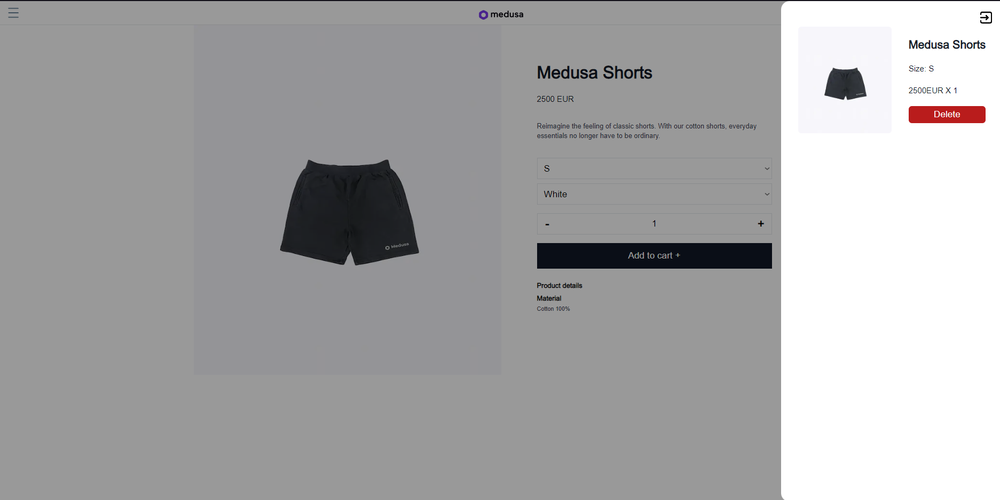

# Storefront

App created in NextJS with typescript and ESlint with function of listing and showing all products and detailed product page.
Also you can add or remove products from cart.

## Getting started

Prerequisite: Node Package Manager (npm) download can be found <a href="https://nodejs.org/en/download/">here</a>.

1. Clone this repository `git clone https://github.com/akrzelj-ossunist/storefront`

2. `npm update` to install all required dependencies.

3. `npm run dev` to start the application. As you make changes the website will be automatically reloaded.

4. `localhost:3000` to see the app you have to go to this website.

## Libraries used for this app

<a href="https://tanstack.com/query/v4/docs/react/installation">-React Query</a>
<a href="https://axios-http.com/docs/intro">-Axios</a>

- Short description of the project
  - Time spent
    -Project didnt take lot of my time. I did it in around 4/5 days but if you sit trough it can be easely done in 1 day.
  - The implementation that was most challenging
    -There was nothing I wasnt familiar with but id say most challenging was setup medusa backend with database because that was first time i was doing that.
  - The implementation you are most proud of
    -I additionaly implemented cart function so id say that would be it.
  - Concise description of how you structured the project and any considerations you might have had
    -I made home page where i listed all products with grid i fetched from endpoint. After that i made every product link to their personal page where customers can see details of that
    product and order if they want to. When they decide to buy product product goes to cart where you can remove it if its not needed anymore.
    -I havent added filtering by collection because value of every product collection is null so i really didnt know based on what i should filter.

## Screenshots

Home:

Product:

Cart

